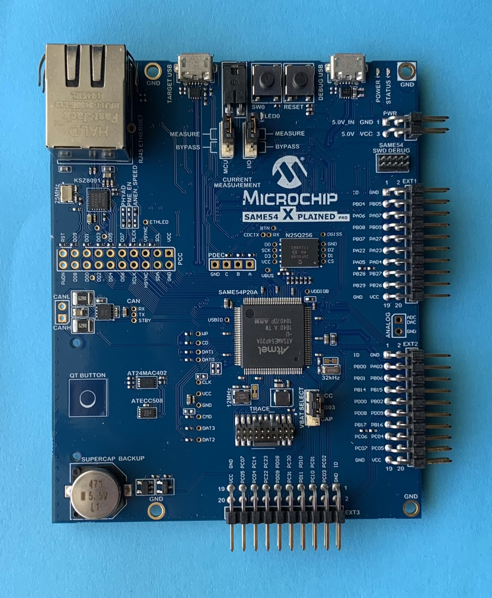

# Hardware requirements

## Components

To follow along with the guide you will need to obtain the following hardware:

### Microchip SAM E54 Xplained Pro evaluation kit

<!--   -->

* [Manufacturers page](https://www.microchip.com/en-us/development-tool/atsame54-xpro)
* [Digi-Key](https://www.digikey.com/en/products/detail/microchip-technology/ATSAME54-XPRO/7354381)
* [Mouser](https://www.mouser.com/c/?q=ATSAME54-XPRO)
* [RS Components](https://uk.rs-online.com/web/p/microcontroller-development-tools/1449434/)

### STMicroelectronics STEVAL-IDB005V1D evaluation board

<!--  -->

* [Manufacturers page](https://www.st.com/en/evaluation-tools/steval-idb005v1d.html)
* [Digi-Key](https://www.digikey.com/en/products/detail/stmicroelectronics/5874030)
* [Mouser](https://www.mouser.com/c/?q=STEVAL-IDB005V1D)
* [RS Components](https://uk.rs-online.com/web/p/communication-wireless-development-tools/1961755/)

> TODO: It would be good if we could replace this with the [Microchip ATWINC3400-XPRO evaluation kit](https://www.microchip.com/en-us/development-tool/ATWINC3400-XPRO) as it does not require fiddly jumpers to connect to the SAM E54 board. ([#2300](https://github.com/ockam-network/ockam/issues/2300))

### Optional: a 3.3V USB <-> Serial module

<!--  -->

While you can complete the guide without this you may find yourselves frustrated at the slow speed of logging output via GDB's semihosting interface.

This module will allow you to instead obtain logging output via one of the serial pins on the SAM E54.

You can use almost any Serial / USB module as long as it is 3.3V:

* [SparkFun FTDI Basic Breakout - 3.3V](https://www.sparkfun.com/products/9873)
* [CH340G USB to TTL module](https://www.aliexpress.com/wholesale?SearchText=CH340G)

> Question: Can I follow the guide with different development hardware?

This depends largely on the amount of previous experience you have with Embedded Rust and Microcontrollers.

Another factor is the degree to which the hardware is supported by the wider Embedded Rust ecosystem. The [Awesome Embedded Rust] list is a good place to get an idea.

Generally, if you're able to get a blinky up and running on your hardware you should be able to follow the guide to at least the Routing examples.

Things may get stickier when it comes to the sections on Transport and Secure Channels. Chances are the guide is using different peripheral hardware than what's supported by the guide. This may mean you will need a low-level understanding of how to access hardware such as Bluetooth, Ethernet, LoraWAN, WiFi and Encryption modules.

[Awesome Embedded Rust]: https://github.com/rust-embedded/awesome-embedded-rust
